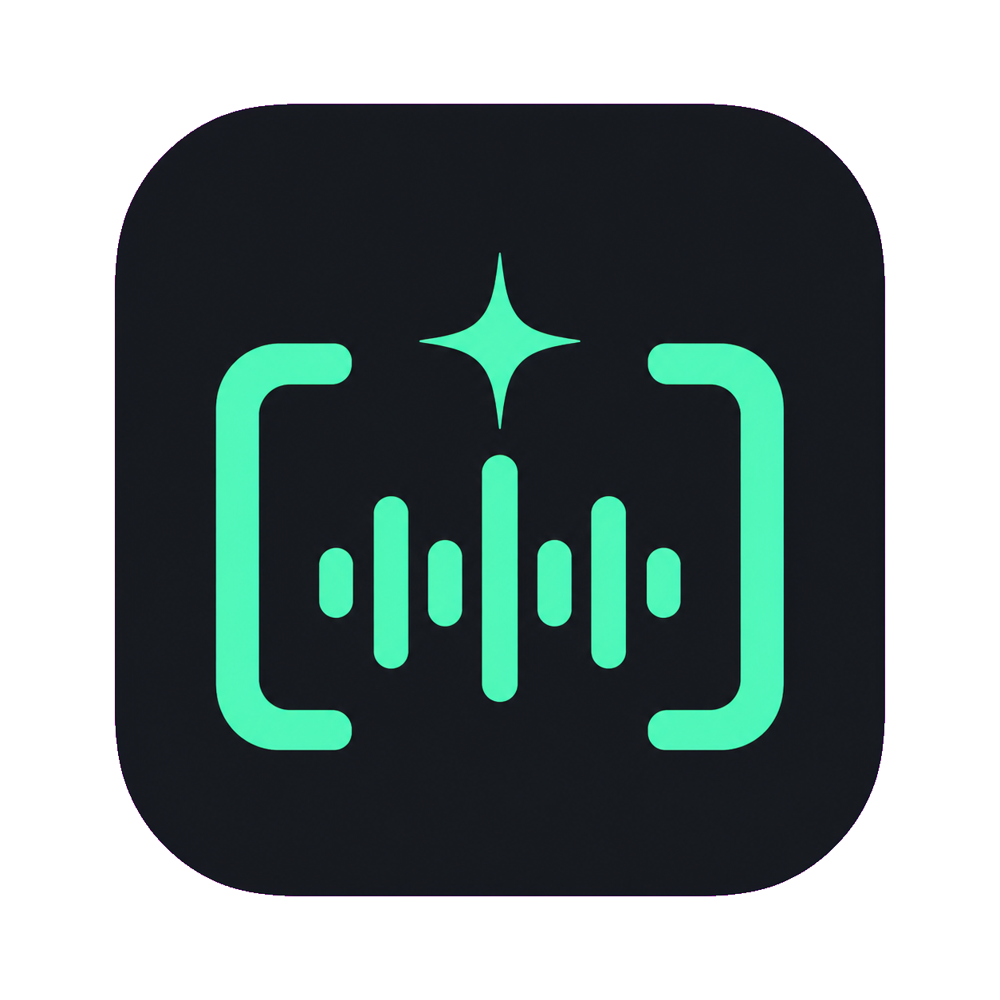

<div align="center">
  
  <h1>NovaCaption</h1>
  <p>基于大语言模型的视频字幕处理工具 — 语音识别、字幕优化、翻译、视频合成一站式处理</p>

  [项目主页](https://github.com/yu-hou/VideoCaptioner-customize) · [反馈](https://github.com/yu-hou/VideoCaptioner-customize/issues) · [Release](https://github.com/yu-hou/VideoCaptioner-customize/releases) · [CLI 使用](#cli-命令行)
</div>

> [!IMPORTANT]
> NovaCaption 是基于 [WEIFENG2333/VideoCaptioner](https://github.com/WEIFENG2333/VideoCaptioner)
> 的独立定制版本，并非上游作者发布、授权或认可的官方商业版本。

## 安装

```bash
pip install videocaptioner          # 安装 CLI + GUI 桌面版
```

免费功能（必剪语音识别、必应/谷歌翻译）**无需任何配置，安装即用**。

## CLI 命令行

```bash
# 语音转录（免费，无需 API Key）
videocaptioner transcribe video.mp4 --asr bijian

# 字幕翻译（免费必应翻译）
videocaptioner subtitle input.srt --translator bing --target-language en

# 全流程：转录 → 优化 → 翻译 → 合成
videocaptioner process video.mp4 --target-language ja

# 字幕烧录到视频
videocaptioner synthesize video.mp4 -s subtitle.srt

# 下载在线视频
videocaptioner download "https://youtube.com/watch?v=xxx"
```

需要 LLM 功能（字幕优化、大模型翻译）时，配置 API Key：

```bash
videocaptioner config set llm.api_key <your-key>
videocaptioner config set llm.api_base https://api.openai.com/v1
videocaptioner config set llm.model gpt-4o-mini
```

配置优先级：`命令行参数 > 环境变量 (VIDEOCAPTIONER_*) > 配置文件 > 默认值`。运行 `videocaptioner config show` 查看当前配置。

<details>
<summary>所有 CLI 命令一览</summary>

| 命令 | 说明 |
|------|------|
| `gui` | 打开桌面版。也可以直接运行 `videocaptioner-gui` |
| `transcribe` | 语音转字幕。引擎：`faster-whisper`、`whisper-api`、`bijian`（免费）、`jianying`（免费）、`whisper-cpp` |
| `subtitle` | 字幕优化/翻译。翻译服务：`llm`、`bing`（免费）、`google`（免费） |
| `dub` | 根据字幕生成配音音轨或配音视频 |
| `synthesize` | 字幕烧录到视频（软字幕/硬字幕） |
| `process` | 全流程处理 |
| `download` | 下载 YouTube、B站等平台视频 |
| `config` | 配置管理（`show`、`set`、`get`、`path`、`init`） |

运行 `videocaptioner <命令> --help` 查看完整参数。完整 CLI 文档见 [docs/cli.md](docs/cli.md)。

</details>

## GUI 桌面版

```bash
pip install videocaptioner
videocaptioner-gui                  # 显式打开桌面版
videocaptioner gui                  # 等价命令
videocaptioner                      # 无参数时也会打开桌面版
```

<details>
<summary>其他安装方式：Windows 安装包 / macOS 一键脚本</summary>

**Windows / macOS**：从 [NovaCaption Release](https://github.com/yu-hou/VideoCaptioner-customize/releases) 下载对应安装包。

**从源码运行**：
```bash
git clone https://github.com/yu-hou/VideoCaptioner-customize.git
cd VideoCaptioner-customize
uv sync
uv run videocaptioner
```

</details>


<!-- <div align="center">
  
</div> -->


## LLM API 配置

LLM 仅用于字幕优化和大模型翻译，免费功能（必剪识别、必应翻译）无需配置。

支持所有 OpenAI 兼容接口的服务商：

| 服务商 | 官网 |
|--------|------|
| SiliconCloud | [cloud.siliconflow.cn](https://cloud.siliconflow.cn) |
| DeepSeek | [platform.deepseek.com](https://platform.deepseek.com) |

在软件设置或 CLI 中填入所选服务商提供的 API Base URL 和 API Key 即可。

## Claude Code Skill

本项目提供了 [Claude Code Skill](https://code.claude.com/docs/en/skills.md)，让 AI 编程助手可以直接调用 NovaCaption 处理视频。

安装到 Claude Code：

```bash
mkdir -p ~/.claude/skills/videocaptioner
cp skills/SKILL.md ~/.claude/skills/videocaptioner/SKILL.md
```

然后在 Claude Code 中输入 `/videocaptioner transcribe video.mp4 --asr bijian` 即可使用。

## 工作原理

```
音视频输入 → 语音识别 → 字幕断句 → LLM 优化 → 翻译 → 视频合成
```

- 词级时间戳 + VAD 语音活动检测，识别准确率高
- LLM 语义理解断句，字幕阅读体验自然流畅
- 上下文感知翻译，支持反思优化机制
- 批量并发处理，效率高

## 开发

```bash
git clone https://github.com/yu-hou/VideoCaptioner-customize.git
cd VideoCaptioner-customize
uv sync && uv run videocaptioner     # 运行 GUI
uv run videocaptioner --help          # 运行 CLI
uv run pyright                        # 类型检查
uv run pytest tests/test_cli/ -q      # 运行测试
```

## 许可证

[GPL-3.0](LICENSE)。上游归属及非官方发行声明见 [NOTICE.md](NOTICE.md)。
